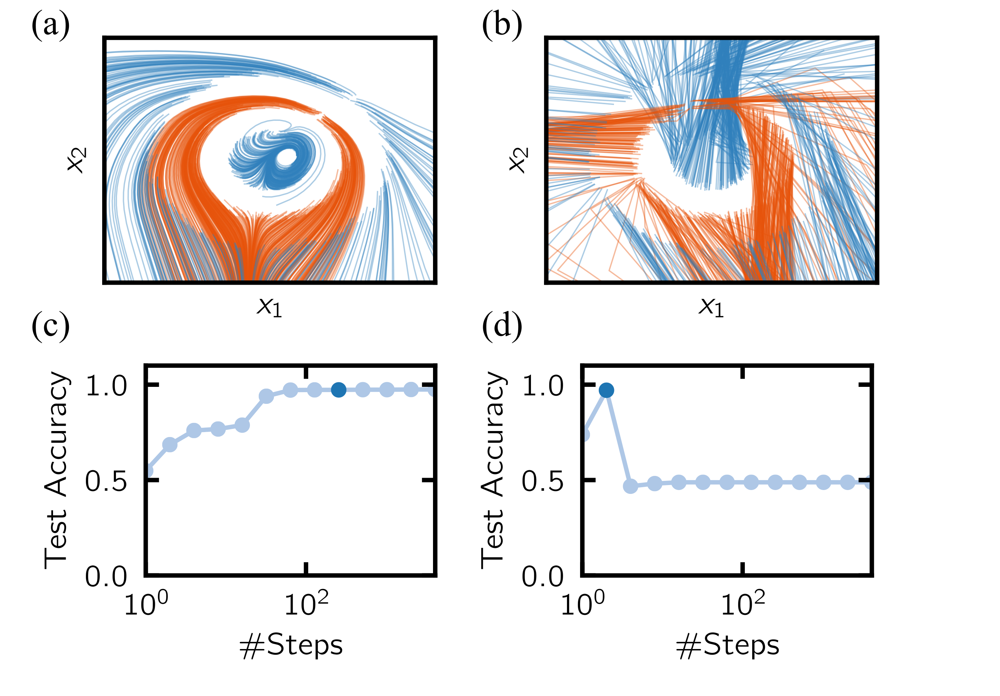

 
# PyTorch Implementation of: ResNet After All? Neural ODEs and Their Numerical Solution
This is the accompanying code for [ResNet After All? Neural ODEs and Their Numerical Solution](https://openreview.net/forum?id=HxzSxSxLOJZ).
The experiments based on this library are fully supported to run on single/multiple gpus. 
By default, the device is set to cpu. 
All our experiments where run on a single GPU.
<p align="center">
  
</p>

## Purpose of the project

This software is a research prototype, solely developed for and published as part of the publication cited above. 
It will neither be maintained nor monitored in any way.

## Requirements 

* Python 3.7 or above
* Packages are listed in [requirements.txt](./requirements.txt)

## Data

Here we list the resources for the specific data sets:

* MNIST: [link](http://yann.lecun.com/exdb/mnist/) 
* CIFAR10: [link](https://www.cs.toronto.edu/~kriz/cifar.html)

Concentric Sphere: Will be automatically generated when running the code, 
see the [data/sphere_dataset_generation](./data/sphere_dataset_generation) directory.

### Training

By running  [train.py](./train.py) the model automatically runs the Concentric Sphere 2D model with step size 1.0.
The results (loss, train/test-accuracy ...) can be found in `/experiments/neural_ode/` by default.
The default number of iterations is set to 3000 iterations (for our experiments on Sphere2 we 
used 10 000 iterations) but this allows one to quickly generate first results on a CPU.

Options can be changed via the command line. For example using Euler's method and a step size of 0.1:

```shell script
python train.py --solver euler --step_size 0.1
```

For more information type
```shell script
python train.py --help
```
All default values are listed in [options/default_config.yaml](./options/default_config.yaml).

#### Using GPU
To use GPU set
 ```shell script
python train.py --use_gpu true
```

#### Using the adjoint method
To use the adjoint method as introduced by [2] (Source: [1]), use
 ```shell script
python train.py --adjoint true
```

#### Apply step adaptation algorithm
To apply the step adaptation algorithm proposed in the paper, use
 ```shell script
python train.py --use_step_adaption_algo true
```
### Reproducing the results of the paper
In general all parameters which need to be specified are given in the supplementary material to the paper.
In all our experiments we used 5 different seed which can also be set via the command line `random_seed` parameter.
Here we present the commands to run experiments for a single seed.

#### Running Experiments for Figure 4 a) :
To generate the data shown in red in Figure 4 a) (corresponding to a training step size of 1/64), run:
```
python train.py --dataset concentric_sphere2 --solver euler --step_size 0.015625 --lr 0.0001 --network simple_odenet --ch_residual_block 32 --batch_size 128 --niter 10000 --evaluate_text_acc true --evaluate_with_different_solver true  --test_solver_list euler midpoint rk4 --test_factor_list 0.5 0.75 1. 1.5 2.
```

All other data points can be generated by changing the `step_size` parameter. 
For Figure 4 b) the parameters `solver` and `test_solver_list` have to be changed accordingly.

#### Running Experiments for Figure 4 d):
To generate the data shown in orange in Figure 4 d) (corresponding to a training tolerance of 0.001), run:
```
python train.py --dataset cifar10 --solver dopri5 --tol 0.001 --lr 0.0001 --network odenet --ch_residual_block 128 --batch_size 256 --niter 7800 --evaluate_text_acc true --evaluate_with_different_solver true  --test_solver_list dopri5 --test_factor_list 0.1 1. 10.
```
All other data points can be generated by changing the `tol` parameter.

#### Running Experiments for Figure 5:
To train the neural ode model with the step adaptation algorithm on CIFAR10 as shown in Figure 5, run:
```
python train.py --dataset cifar10 --solver euler --lr 0.0001 --network odenet --ch_residual_block 128 --batch_size 256 --niter 7800 --evaluate_text_acc true --use_step_adaptation true 
```


### References
[1] [torchdiffeq](https://github.com/rtqichen/torchdiffeq)

[2] Ricky T. Q. Chen, Yulia Rubanova, Jesse Bettencourt, David Duvenaud. 
"Neural Ordinary Differential Equations." *Advances in Neural Processing Information Systems.* 2018. 
[[arxiv]](https://arxiv.org/abs/1806.07366)


## License

Numerics-Independent-Neural-ODEs is open-sourced under the AGPL-3.0 license. See the [LICENSE](LICENSE) file for details.

For a list of other open source components included in Numerics-Independent-Neural-ODEs, see the file 
[3rd-party-licenses.txt](3rd-party-licenses.txt).
